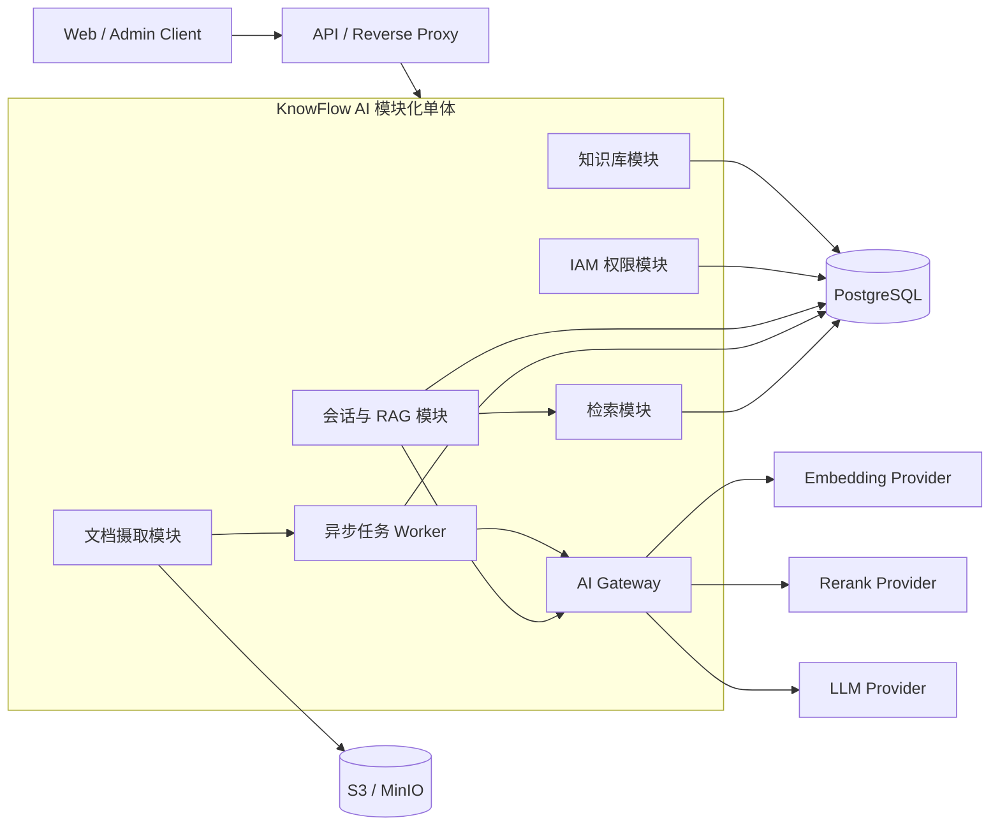
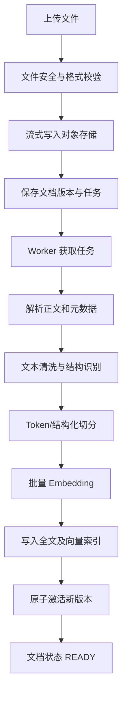
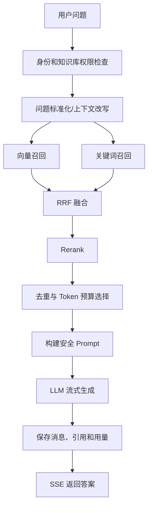

# KnowFlow AI 系统架构设计

## 1. 文档信息

| 项目 | 内容 |
|---|---|
| 项目名称 | KnowFlow AI |
| 项目类型 | 企业级 AI 智能知识库 / RAG 平台 |
| 后端技术栈 | Java + Spring Boot |
| 架构阶段 | MVP 架构设计 |
| 核心原则 | 模块化、可维护、可扩展、不过度设计 |
| 首期部署形态 | 模块化单体 |
| 后续演进 | 独立 Worker、OpenSearch、Agent、MCP、工作流、微服务 |

---

## 2. 架构目标

KnowFlow AI 第一阶段需要完成一条可用、可观测、可追踪的 RAG 主链路：

```text
用户登录
  → 创建知识库
  → 上传文档
  → 文档解析与切分
  → Embedding 向量化
  → 混合检索
  → Rerank
  → LLM 生成答案
  → 返回引用来源
  → 保存对话记录
```

架构设计遵循以下原则：

1. 首期采用模块化单体，不直接拆微服务。
2. 模块之间通过应用接口或领域事件交互，禁止跨模块直接操作数据表。
3. LLM、Embedding、Rerank、向量数据库都通过抽象端口接入。
4. 原始文件、业务元数据、切片和向量数据分层保存。
5. 文档处理采用异步、可重试、可恢复的任务模型。
6. 权限过滤必须发生在检索阶段，不能检索后再过滤。
7. 完整聊天记录与提供给模型的上下文记忆分开管理。
8. 所有生成答案尽可能带有可验证的文档引用。

---

## 3. 总体系统架构

### 3.1 MVP 架构



MVP 只部署一个 Spring Boot 应用，但内部明确区分 HTTP 请求线程和文档处理 Worker。后续可以使用相同模块代码，将 Worker 独立部署。

### 3.2 数据存储职责

| 存储 | 职责 |
|---|---|
| PostgreSQL | 用户、权限、知识库、文档元数据、任务、切片、聊天记录、审计 |
| pgvector | Embedding 向量及相似度检索 |
| PostgreSQL FTS | MVP 关键词/全文召回 |
| S3 / MinIO | PDF、Word 等原始文件 |
| Redis | MVP 非必需；后续用于缓存、限流、分布式锁和短期记忆 |
| OpenSearch | 后续用于更强的中文关键词检索、大规模混合检索 |

### 3.3 为什么首期不拆微服务

首期业务边界还在快速变化，拆微服务会提前引入：

- 分布式事务；
- 服务治理；
- 消息一致性；
- 链路追踪复杂度；
- 多服务部署和版本协调。

模块化单体已经可以通过 Maven 模块、包可见性和 Spring Modulith/ArchUnit 约束依赖方向。Spring Modulith 支持验证模块间无循环依赖，适合作为模块边界检查工具。

---

## 4. 后端模块划分

### 4.1 模块列表

| Maven 模块 | 职责 |
|---|---|
| `knowflow-bootstrap` | 应用启动、模块装配、全局配置、异常处理、安全过滤器 |
| `knowflow-shared-kernel` | ID、分页、错误码、时间、领域事件等最小公共模型 |
| `knowflow-iam` | 登录、用户、租户、角色、权限、Token、知识库访问鉴权 |
| `knowflow-knowledge` | 知识库、文档元数据、文档版本、成员和配置管理 |
| `knowflow-ingestion` | 文件上传、解析、清洗、切分、Embedding、索引构建、任务重试 |
| `knowflow-retrieval` | 关键词检索、向量检索、结果融合、过滤、Rerank |
| `knowflow-conversation` | 会话、消息、上下文记忆、RAG 编排、SSE 输出、引用记录 |
| `knowflow-ai-gateway` | Chat、Embedding、Rerank 模型的统一接口与供应商适配 |
| `knowflow-audit` | 登录、权限变更、文档操作、模型调用等审计事件 |

### 4.2 模块依赖

```text
bootstrap
 ├── iam
 ├── knowledge
 ├── ingestion ──────→ knowledge, ai-gateway
 ├── retrieval ──────→ knowledge, ai-gateway
 ├── conversation ───→ knowledge, retrieval, ai-gateway
 └── audit

所有模块 ────────────→ shared-kernel
```

约束：

- `knowledge` 不直接依赖 `conversation`。
- `retrieval` 不直接操作聊天记录。
- `conversation` 只能调用检索模块提供的应用接口。
- 业务模块不能直接依赖其他模块的 Mapper、Entity 或 Repository 实现。
- `shared-kernel` 不能演变成无边界的 `common-utils`。

---

## 5. 推荐项目目录

```text
knowflow-ai/
├── pom.xml
├── README.md
├── docs/
│   ├── ARCHITECTURE.md
│   ├── API.md
│   └── adr/
├── deploy/
│   ├── docker-compose.yml
│   ├── postgres/
│   ├── minio/
│   └── monitoring/
├── modules/
│   ├── knowflow-bootstrap/
│   ├── knowflow-shared-kernel/
│   ├── knowflow-iam/
│   ├── knowflow-knowledge/
│   ├── knowflow-ingestion/
│   ├── knowflow-retrieval/
│   ├── knowflow-conversation/
│   ├── knowflow-ai-gateway/
│   └── knowflow-audit/
└── scripts/
    ├── dev/
    └── database/
```

MVP 可以由 `knowflow-bootstrap` 打包为一个可执行 JAR。Maven 多模块用于编译期边界约束，不代表需要分别部署。

---

## 6. Java Package 结构

基础包名：

```text
com.knowflow.ai
```

每个业务模块内部采用轻量级六边形架构：

```text
com.knowflow.ai.knowledge
├── interfaces
│   └── rest
│       ├── KnowledgeBaseController
│       ├── request
│       ├── response
│       └── assembler
├── application
│   ├── command
│   ├── query
│   ├── service
│   └── port
│       ├── in
│       └── out
├── domain
│   ├── model
│   ├── service
│   ├── event
│   ├── repository
│   └── exception
└── infrastructure
    ├── persistence
    │   ├── entity
    │   ├── mapper
    │   └── repository
    ├── client
    └── config
```

各层职责：

| Package | 职责 |
|---|---|
| `interfaces` | HTTP、SSE 等外部协议适配，不包含业务规则 |
| `application` | 用例编排、事务边界、命令与查询处理 |
| `domain` | 核心模型、业务规则、领域服务、仓储接口 |
| `infrastructure` | 数据库、对象存储、模型服务等技术实现 |

禁止出现全局横向结构：

```text
controller/
service/
mapper/
entity/
```

这种结构在项目扩大后会破坏业务边界。

### 6.1 AI Gateway 包结构

```text
com.knowflow.ai.aigateway
├── application
│   ├── ChatModelPort
│   ├── EmbeddingModelPort
│   └── RerankModelPort
├── domain
│   ├── ChatRequest
│   ├── ChatResponse
│   ├── EmbeddingRequest
│   └── RerankResult
└── infrastructure
    ├── springai
    ├── openai
    ├── ollama
    └── local
```

业务模块只依赖 `ChatModelPort`、`EmbeddingModelPort` 和 `RerankModelPort`，不直接使用某个供应商 SDK。Spring AI 可以作为适配层基础，但不应让 Spring AI 类型扩散到领域层。

---

## 7. 数据库设计

### 7.1 通用规范

- 主键使用 UUID，推荐 UUIDv7。
- 时间字段使用 PostgreSQL `timestamptz`，统一保存 UTC。
- 企业数据表包含 `tenant_id`。
- 可变配置使用 `jsonb`，稳定查询字段必须结构化。
- 关键聚合使用 `version` 实现乐观锁。
- 业务删除使用 `deleted_at`，向量和对象文件再异步清理。
- 数据库变更全部通过 Flyway 管理。
- 密钥不以明文保存在数据库中，只保存 `credential_ref`。

### 7.2 IAM 表

| 表 | 关键字段 | 说明 |
|---|---|---|
| `iam_tenant` | `id, code, name, status` | 租户/组织 |
| `iam_user` | `id, username, email, password_hash, status` | 用户 |
| `iam_tenant_member` | `tenant_id, user_id, status` | 用户所属租户 |
| `iam_role` | `id, tenant_id, code, name, built_in` | 角色 |
| `iam_permission` | `id, code, resource, action` | 权限点 |
| `iam_member_role` | `member_id, role_id` | 用户角色 |
| `iam_role_permission` | `role_id, permission_id` | 角色权限 |
| `iam_refresh_token` | `token_hash, user_id, expires_at, revoked_at` | 刷新令牌 |

MVP 内置租户角色：

- `OWNER`
- `ADMIN`
- `MEMBER`

知识库级角色：

- `MANAGER`
- `EDITOR`
- `VIEWER`

### 7.3 知识库与文档表

| 表 | 关键字段 | 说明 |
|---|---|---|
| `kb_knowledge_base` | `tenant_id, name, description, owner_id, status` | 知识库 |
| `kb_member` | `knowledge_base_id, user_id, role` | 知识库权限 |
| `kb_document` | `knowledge_base_id, name, current_version_id, status` | 逻辑文档 |
| `kb_document_version` | `document_id, version_no, object_key, checksum, mime_type, size, status` | 文档物理版本 |
| `rag_ingestion_job` | `document_version_id, stage, status, progress, retry_count, error` | 摄取任务 |
| `rag_document_chunk` | `document_version_id, chunk_no, content, metadata, embedding` | 文档切片 |

知识库推荐字段：

```text
id
tenant_id
name
description
visibility
owner_id
status
embedding_model
embedding_dimension
chunk_strategy
chunk_config jsonb
retrieval_config jsonb
created_at
updated_at
deleted_at
version
```

文档版本状态：

```text
UPLOADED
PARSING
CHUNKING
EMBEDDING
INDEXING
READY
FAILED
SUPERSEDED
```

摄取任务状态：

```text
PENDING
RUNNING
RETRY_WAIT
SUCCEEDED
FAILED
CANCELLED
```

切片推荐字段：

```text
id
tenant_id
knowledge_base_id
document_id
document_version_id
chunk_no
content
content_hash
token_count
page_no
section_title
metadata jsonb
search_vector tsvector
embedding vector(D)
embedding_model
active
created_at
```

其中 `D` 是 MVP 全局固定的 Embedding 维度。首期不允许知识库随意切换不同维度；切换模型必须执行完整重建索引。

推荐索引：

```text
B-Tree (tenant_id, knowledge_base_id, active)
B-Tree (document_version_id, chunk_no)
GIN (search_vector)
HNSW (embedding vector_cosine_ops)
UNIQUE (document_version_id, chunk_no)
UNIQUE (document_id, version_no)
```

### 7.4 会话表

| 表 | 关键字段 | 说明 |
|---|---|---|
| `chat_conversation` | `tenant_id, user_id, knowledge_base_id, title, status` | 会话 |
| `chat_message` | `conversation_id, sequence_no, role, content, status` | 完整聊天记录 |
| `chat_message_citation` | `message_id, chunk_id, document_name, page_no, score` | 答案引用 |
| `chat_feedback` | `message_id, user_id, rating, reason` | 用户反馈，可在第二阶段实现 |

`chat_message` 还应保存：

```text
model_name
prompt_tokens
completion_tokens
latency_ms
finish_reason
request_id
created_at
```

引用表需要保存一份文档名称、版本、页码和文本摘要快照。即使原文档后来删除，历史回答仍可审计。

### 7.5 审计表

```text
audit_log
- id
- tenant_id
- operator_id
- action
- resource_type
- resource_id
- result
- client_ip
- user_agent
- request_id
- detail jsonb
- created_at
```

---

## 8. RAG 数据流程

### 8.1 文档摄取流程



处理要求：

1. 上传接口不等待解析完成。
2. 文件写入对象存储时计算 SHA-256。
3. 事务中保存文档版本和摄取任务。
4. Worker 使用 `FOR UPDATE SKIP LOCKED` 领取任务。
5. 每个阶段记录状态、耗时和错误。
6. Embedding 使用批处理、超时、限流和指数退避。
7. 新版本索引成功后再切换为 `active=true`。
8. 失败时保留旧版本，不破坏现有检索。
9. 任务必须支持重试和人工重新执行。

文档解析首期使用 Apache Tika。Tika 对 Office 格式的解析基于 Apache POI，也支持常见文档格式的正文和元数据提取。

### 8.2 文本切分策略

MVP 推荐：

- 优先按标题、段落和页边界切分；
- 再按照模型 Token 数限制切分；
- 默认 `500～800 tokens`；
- 重叠 `50～100 tokens`；
- 表格、代码块尽量保持完整；
- 在 metadata 中保留标题路径、页码、文件名和版本号。

切分参数应属于知识库配置，但参数变更后必须触发重新索引。

### 8.3 查询与生成流程



推荐默认参数：

```text
vectorTopK = 40
keywordTopK = 40
fusionTopK = 30
rerankTopN = 20
finalContextTopN = 5～8
```

这些参数不能仅凭经验固定，应通过评测集持续调整。

### 8.4 混合检索

MVP：

1. pgvector 完成向量召回；
2. PostgreSQL FTS 完成关键词召回；
3. 中文场景可增加 `pg_trgm` 字符相似度召回；
4. 使用 RRF（Reciprocal Rank Fusion）融合不同结果排名；
5. 对融合后的 Top N 执行 Rerank。

当中文分词、同义词、搜索分析能力成为主要瓶颈时，引入 OpenSearch。`RetrievalPort` 保持不变，避免修改会话和 RAG 编排模块。

### 8.5 Rerank

定义统一接口：

```text
RerankModelPort.rerank(query, candidates, topN)
```

支持：

- 云端 Rerank API；
- 自部署 BGE Reranker；
- 其他 Cross-Encoder 模型；
- 服务不可用时降级到 RRF 结果。

Rerank 默认采用 fail-open：超时只降低排序质量，不中断问答。

### 8.6 上下文记忆

必须区分：

- 聊天历史：数据库中的完整消息记录；
- 模型记忆：本次请求实际提供给模型的有限上下文。

MVP 使用：

```text
最近 N 条消息
+ Token 窗口
+ 可选会话摘要
```

后续再增加：

- 滚动摘要；
- 长期用户记忆；
- 对话向量记忆；
- 基于事实的结构化记忆。

---

## 9. API 接口规划

统一前缀：

```text
/api/v1
```

### 9.1 认证与用户

| Method | Path | 说明 |
|---|---|---|
| `POST` | `/auth/login` | 用户登录 |
| `POST` | `/auth/refresh` | 刷新 Access Token |
| `POST` | `/auth/logout` | 注销并撤销 Refresh Token |
| `GET` | `/users/me` | 当前用户信息 |
| `GET` | `/admin/users` | 用户列表 |
| `POST` | `/admin/users` | 创建用户 |
| `PUT` | `/admin/users/{id}/roles` | 分配角色 |

MVP 可使用本地用户名密码和非对称 JWT；后续接入 Keycloak、企业 OIDC 或 LDAP。

### 9.2 知识库

| Method | Path | 说明 |
|---|---|---|
| `POST` | `/knowledge-bases` | 创建知识库 |
| `GET` | `/knowledge-bases` | 分页查询 |
| `GET` | `/knowledge-bases/{id}` | 查询详情 |
| `PATCH` | `/knowledge-bases/{id}` | 修改配置 |
| `DELETE` | `/knowledge-bases/{id}` | 删除知识库 |
| `GET` | `/knowledge-bases/{id}/members` | 查询成员 |
| `PUT` | `/knowledge-bases/{id}/members/{userId}` | 设置成员权限 |
| `DELETE` | `/knowledge-bases/{id}/members/{userId}` | 移除成员 |

### 9.3 文档和摄取任务

| Method | Path | 说明 |
|---|---|---|
| `POST` | `/knowledge-bases/{id}/documents` | Multipart 上传文档 |
| `GET` | `/knowledge-bases/{id}/documents` | 文档列表 |
| `GET` | `/documents/{id}` | 文档详情及处理状态 |
| `GET` | `/documents/{id}/versions` | 文档版本 |
| `POST` | `/documents/{id}/reprocess` | 重新解析和索引 |
| `DELETE` | `/documents/{id}` | 删除文档 |
| `GET` | `/ingestion-jobs/{id}` | 查询摄取进度 |
| `POST` | `/ingestion-jobs/{id}/retry` | 重试失败任务 |

### 9.4 检索

| Method | Path | 说明 |
|---|---|---|
| `POST` | `/knowledge-bases/{id}/search` | 检索调试 |
| `GET` | `/knowledge-bases/{id}/chunks/{chunkId}` | 查询切片详情 |

搜索请求支持：

```json
{
  "query": "什么是 KnowFlow AI？",
  "mode": "HYBRID",
  "topK": 10,
  "rerank": true,
  "filters": {
    "documentIds": [],
    "tags": []
  }
}
```

### 9.5 会话与问答

| Method | Path | 说明 |
|---|---|---|
| `POST` | `/conversations` | 创建会话 |
| `GET` | `/conversations` | 会话列表 |
| `GET` | `/conversations/{id}` | 会话详情 |
| `PATCH` | `/conversations/{id}` | 修改标题 |
| `DELETE` | `/conversations/{id}` | 删除会话 |
| `GET` | `/conversations/{id}/messages` | 消息列表 |
| `POST` | `/conversations/{id}/messages` | 发起问答，SSE 返回 |
| `POST` | `/messages/{id}/feedback` | 提交反馈 |

SSE 事件建议：

```text
message.started
retrieval.completed
message.delta
citation
message.completed
message.error
```

### 9.6 API 规范

- 使用 `application/problem+json` 表达标准错误。
- 列表接口使用游标分页或统一分页对象。
- 上传、重试和消息发送支持 `Idempotency-Key`。
- 所有响应携带 `requestId`。
- SSE 断开后，客户端可以根据消息 ID 查询最终状态。
- Controller DTO 不直接复用数据库 Entity。

---

## 10. 技术选型

| 领域 | MVP 选型 | 后续演进 |
|---|---|---|
| Java | Java 21 LTS | 经过兼容性验证后升级 |
| Web 框架 | Spring Boot + Spring MVC | 独立网关 |
| AI 框架 | Spring AI，外部再包一层 Port | Agent、Tool Calling、MCP |
| 安全 | Spring Security、JWT、RBAC | OIDC、Keycloak、LDAP、SSO |
| 数据库 | PostgreSQL | 读副本、分区、归档 |
| 数据访问 | MyBatis | 保留复杂检索 SQL 的控制力 |
| 向量检索 | pgvector HNSW | OpenSearch、Qdrant、Milvus |
| 全文检索 | PostgreSQL FTS / pg_trgm | OpenSearch |
| 文件解析 | Apache Tika | OCR、版面分析、表格模型 |
| 对象存储 | MinIO（开发）、S3 兼容存储（生产） | 云对象存储 |
| 数据迁移 | Flyway | 保持不变 |
| 异步任务 | PostgreSQL 任务表 | RabbitMQ/Kafka + Outbox |
| 缓存 | MVP 不强制 Redis | Redis |
| API 文档 | springdoc-openapi | API Portal |
| 稳定性 | Resilience4j | 服务网格视规模决定 |
| 测试 | JUnit 5、Testcontainers、ArchUnit | RAG 自动评测平台 |
| 可观测性 | Actuator、Micrometer、OpenTelemetry | Prometheus、Grafana、Tempo |
| 部署 | Docker Compose / 单体容器 | Kubernetes |

版本管理原则：

- Spring Boot 与 Spring AI 使用经过验证的兼容 BOM。
- 禁止依赖浮动版本或直接使用 `latest`。
- 每次升级先验证模型调用、SSE、pgvector、文档解析和数据库迁移。

---

## 11. 安全设计

1. 所有知识库查询必须同时带 `tenant_id` 和知识库权限条件。
2. 权限条件必须下推到关键词和向量查询中。
3. 对象存储的 `object_key` 不直接返回前端。
4. 下载使用短期签名 URL 或经过鉴权的流式接口。
5. 校验文件扩展名、MIME、Magic Number 和大小。
6. 生产环境增加恶意文件扫描。
7. 模型密钥保存于环境变量或 Secret Manager。
8. 日志不得记录密码、Token、模型密钥和完整敏感文档。
9. RAG Prompt 明确声明检索内容是不可信数据，不执行文档中的指令。
10. 管理操作、文档下载、权限变更和模型调用写入审计日志。

---

## 12. 可观测性

需要重点监控：

### 文档处理

- 上传数量和大小；
- 各阶段成功率；
- 解析、切分和 Embedding 耗时；
- 失败类型和重试次数；
- 待处理任务积压。

### 检索

- 向量、关键词、融合、Rerank 各阶段耗时；
- 候选数量；
- 无召回比例；
- Rerank 降级次数。

### 模型调用

- Provider、模型名称；
- 首 Token 延迟；
- 总响应耗时；
- Token 使用量；
- 超时、限流和错误率；
- 单次及租户成本。

禁止将用户 ID、文档 ID 等高基数字段作为 Prometheus 标签，应放入 Trace 属性或结构化日志。

---

## 13. 测试与 RAG 评测

### 13.1 工程测试

- Domain 单元测试；
- Application 用例测试；
- PostgreSQL/pgvector Testcontainers 集成测试；
- 对象存储集成测试；
- 模型 Provider 契约测试；
- 权限隔离测试；
- 文档重试和幂等测试；
- ArchUnit 模块依赖测试。

### 13.2 RAG 评测

建立小型黄金数据集，持续评估：

- Recall@K；
- MRR / nDCG；
- 引用准确率；
- 答案忠实度；
- 无答案识别能力；
- Prompt 注入抵抗能力；
- 不同切分参数和模型的效果。

没有评测集时，不应仅凭主观感受调整 `topK`、切片大小和 Rerank 参数。

---

## 14. 开发阶段划分

### 阶段 0：工程骨架

- Maven 多模块；
- Spring Boot 启动模块；
- Flyway；
- 统一异常和响应规范；
- Docker Compose；
- 日志、Actuator、OpenAPI；
- 模块依赖测试。

### 阶段 1：权限和知识库

- 用户登录；
- JWT Access/Refresh Token；
- RBAC；
- 租户隔离；
- 知识库 CRUD；
- 知识库成员权限；
- 审计日志基础能力。

### 阶段 2：文档摄取

- PDF、Word、TXT、Markdown 上传；
- MinIO/S3 存储；
- Tika 解析；
- 文档版本；
- 文本清洗和切分；
- PostgreSQL 任务 Worker；
- Embedding；
- pgvector 索引；
- 失败重试和进度查询。

### 阶段 3：检索与 Rerank

- 向量召回；
- 关键词召回；
- RRF 融合；
- Metadata/ACL 过滤；
- Rerank Provider；
- 检索调试 API；
- 黄金数据集和基础评测。

### 阶段 4：RAG 问答

- 会话和消息；
- 短期上下文记忆；
- Query Rewrite；
- Prompt 模板；
- SSE 流式生成；
- 引用来源；
- Token、延迟、模型用量记录。

完成阶段 0～4 即形成 MVP。

### 阶段 5：企业增强

- OIDC/SSO；
- OpenSearch；
- OCR 和复杂版面解析；
- Redis；
- 消息队列和 Outbox；
- 独立 Ingestion Worker；
- 配额、限流、成本统计；
- 数据保留和合规策略；
- Kubernetes 部署。

### 阶段 6：Agent / MCP / 工作流

新增独立模块：

```text
knowflow-agent
knowflow-mcp
knowflow-workflow
knowflow-tool-registry
```

扩展能力：

- Tool Calling；
- MCP Client / Server；
- Agent 运行记录；
- 工具权限控制；
- 工作流定义和版本；
- 节点执行状态；
- 人工审批；
- 沙箱与超时控制。

---

## 15. MVP 明确不做的内容

为了控制复杂度，MVP 暂不实现：

- 微服务拆分；
- Kafka/RabbitMQ；
- 多向量数据库同时运行；
- 用户自定义 Agent；
- 图数据库；
- 多模态视频知识库；
- 复杂工作流引擎；
- 跨知识库长期用户记忆；
- Embedding 模型在线无缝切换；
- 自动模型路由；
- Kubernetes 强依赖。

这些能力均通过模块边界和端口接口保留扩展位置，但不提前实现。

---

## 16. 最终架构结论

KnowFlow AI 推荐从“模块化单体 + PostgreSQL/pgvector + S3/MinIO + Spring AI 适配层”起步。

最重要的架构边界是：

```text
文档管理 ≠ 文档处理
检索 ≠ RAG 生成
聊天历史 ≠ 模型记忆
领域模型 ≠ Spring AI 模型
业务数据 ≠ 原始文件
权限校验 ≠ 检索后过滤
```

这套结构能够满足 MVP 开发效率，同时允许后续独立扩展文档 Worker、OpenSearch、模型服务、Agent、MCP 和工作流，而不需要推翻第一阶段的核心代码。
